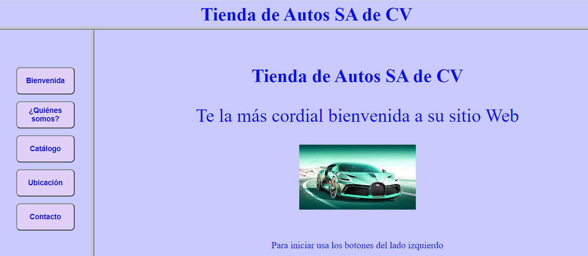
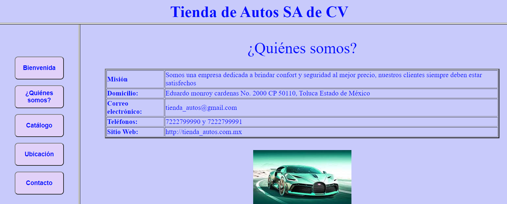
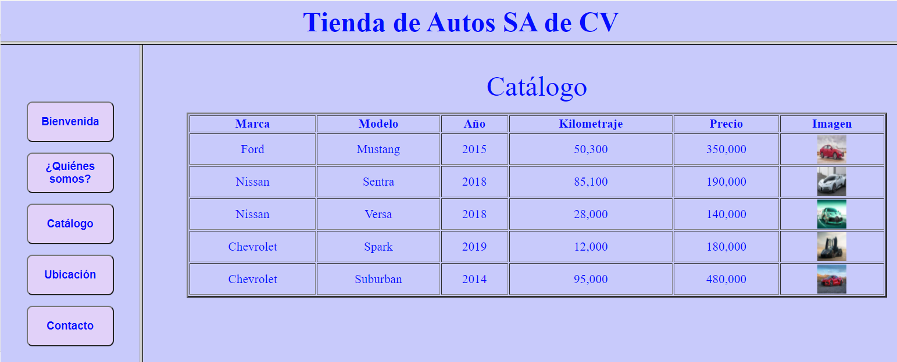
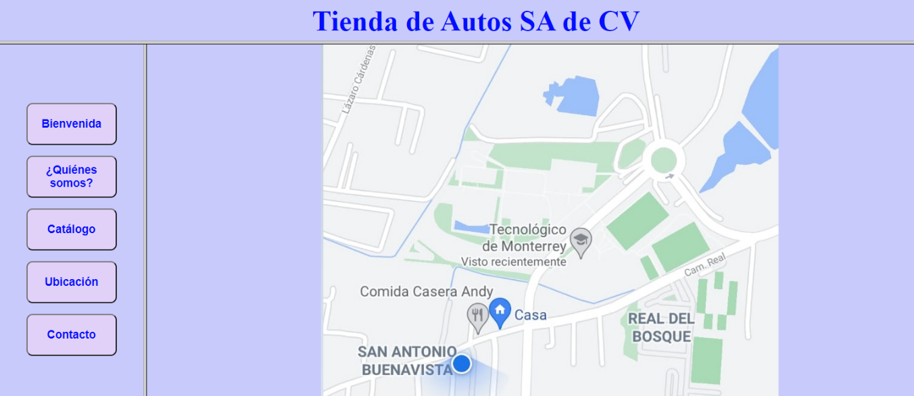
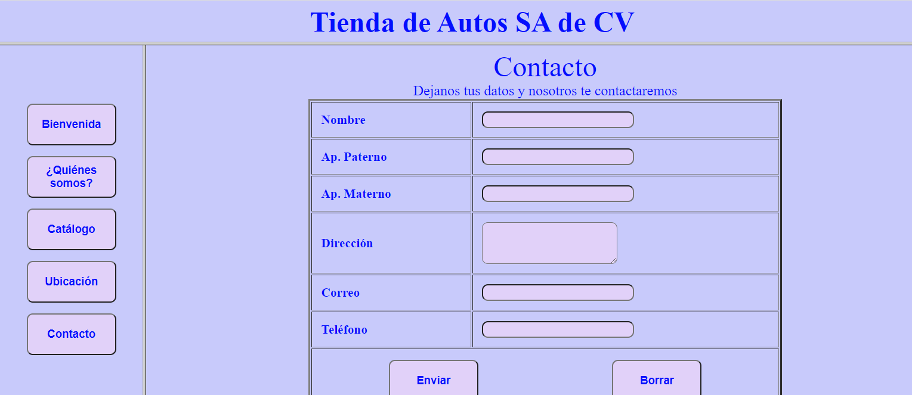

INSTITUTO TECNOLÓGICO Y DE ESTUDIOS SUPERIORES DE MONETRREY

CAMPUS TOLUCA

PROYECTO FINAL

TÓPICO DE PREPA

Una empresa dedicada a la venta de productos (usted decida el producto que desea vender en su 
empresa) le ha solicitado elaborar una página Web para tener presencia en internet, su página debe 
cumplir con las siguientes condiciones:

Al iniciar la carga de su página, esta deberá estar dividida en TRES secciones, la parte superior deberá 
mostrar  el  nombre  de  la  empresa  y  es  un  encabezado  fijo,  en  la  parte  inferior  izquierda  deberá 
mostrar un menú como el que se ve en la imagen. En la parte inferior derecha deberá mostrar una 
bienvenida al inicio y esta sección (inferior derecha) será la sección donde se ejecuten las acciones 
del menú.

Recuerde que cada una de las acciones del menú del lado izquierdo se debe ejecutar en la sección
inferior derecha, donde ahora aparece la bienvenida.
Botón Bienvenida: Este botón lo debe llevar a la bienvenida sin importar donde se encuentre, su
bienvenida debe tener texto en diferentes tamaños y al menos una imagen.

- Botón ¿Quiénes somos?: Este botón debe mostrar los datos de la empresa dentro de una tabla
y debe tener al menos una imagen del giro de la empresa, observe la siguiente imagen:
  - 
- Botón Catálogo: Este botón debe mostrar un catálogo con al menos 5 de los productos o
variaciones del producto que vende su empresa, dicha tabla debe mostrar información referente
al producto así como una imagen del producto en tamaño 50 X 50, observe la siguiente imagen:
  - 
- Botón ubicación: debe mostrar una imagen con la ubicación de le empresa, observe la imagen:
  - 
- Botón Contacto: Finalmente este botón debe mostrar un formulario, dentro de una tabla, donde
el usuario podrá capturar sus datos y de esta forma la empresa pueda contactarlo, observe la
imagen:
  - 

